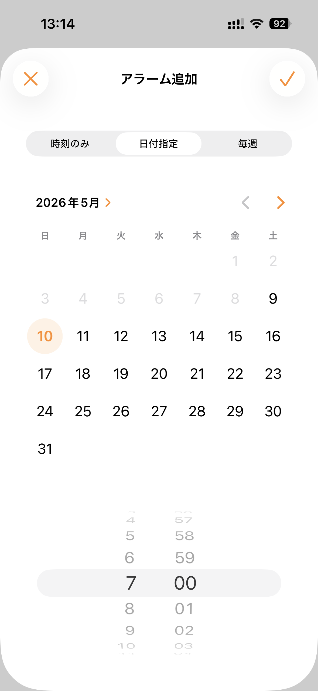

<!-- _class: title -->

# AlarmKitで<br>明後日確実に起きれるアプリ<br>あさってアラームを作った

iOS 26 / AlarmKit

trickart

---

# 自己紹介

- 名前：trickart
- 仕事：POSレジアプリ開発
- どうしても明後日起きたくてAIに作らせたアプリの話です

---

# こんな経験ありませんか？

- 出張・旅行で **明後日の朝早く起きたい**
- iOS標準アラームで設定しようとすると…
  - 基本24時間先までしか設定できない
  - 「明日設定しよう」→忘れる

> **明後日を設定できるアラームが欲しい**

---

# あさってアラーム<br>DayAfterTomorrow

## 明後日のアラームが設定できるアプリ

- 開くと **2日後の日付** がもう選ばれている
- iOS 26+ / AlarmKit 製



---

# AlarmKitとは？

WWDC2025（Session 230）で発表された新フレームワーク

- iOS 26+ 専用
- サードパーティアプリから **OS標準アラームと同等**のアラームを鳴らせる
  - サイレントモード・集中モードを **貫通** して鳴る
  - ロック画面でフルスクリーン表示
  - Apple Watchとも連携
- これまで `UNCalendarNotificationTrigger` でやっていた「擬似アラーム」では実現できなかった体験

---

# AlarmKitを使うのに必要なもの

```xml
<!-- Info.plist -->
<key>NSAlarmKitUsageDescription</key>
<string>目覚ましアラームを鳴らすために使用します</string>
```

```swift
// 認可
switch AlarmManager.shared.authorizationState {
case .notDetermined:
    let state = try await AlarmManager.shared.requestAuthorization()
    isAuthorized = state == .authorized
case .authorized:  isAuthorized = true
case .denied:      // 設定で有効化をお願い
}
```

通知の認可とは **別系統**。`NSAlarmKitUsageDescription` を忘れるとクラッシュ。

---

# AlarmKitの3つのスケジュール

| AlarmKit Schedule | 用途 |
|---|---|
| `.relative(repeats: .never)` | 次回その時刻に1回 |
| `.relative(repeats: .weekly([.monday]))` | 曜日リピート |
| `.fixed(Date)` | **特定の日の特定時刻** |

あさってアラームでは **`.fixed` モードを活用** ＝「明後日 7:00」

---

# .fixedモードによる日時指定

`Alarm.Suchedule.fixed(date)` を生成する

```swift
// 明後日
static var dayAfterTomorrow: Date {
    Calendar.current.date(
        byAdding: .day, value: 2, to: Calendar.current.startOfDay(for: .now)
    )!
}

// 明後日の日付 + 7:00 を組み立てる
var components = Calendar.current.dateComponents(
    [.year, .month, .day], from: dayAfterTomorrow
)
components.hour = 7
components.minute = 0

// Alarm.Schedule生成
let schedule: Alarm.Schedule = .fixed(Calendar.current.date(from: components)!)
```

---

# Alarm Configurationの組み立て

AlarmManagerに直接渡すやつ

```swift
// アラーム鳴動中に表示される内容(ここではスヌーズを追加)
let alertContent = AlarmPresentation.Alert(
    title: "あさってアラーム",
    secondaryButton: AlarmButton(text: "Snooze", textColor: .black,
                                 systemImageName: "repeat.circle"),
    secondaryButtonBehavior: .countdown // ← スヌーズ
)

let configuration = AlarmManager.AlarmConfiguration(
    countdownDuration: .init(preAlert: nil, postAlert: 5 * 60),
    schedule: schedule,
    attributes: AlarmAttributes(presentation: .init(alert: alertContent),
                                tintColor: .orange),
    stopIntent: StopAlarmIntent(alarmID: id.uuidString),
    secondaryIntent: SnoozeAlarmIntent(alarmID: id.uuidString)
)

try await AlarmManager.shared.schedule(id: id, configuration: configuration)
```

---

# Stop / Snoozeは LiveActivityIntent

ロック画面・Dynamic Islandから直接呼ばれる App Intent

```swift
struct StopAlarmIntent: LiveActivityIntent {
    static var title: LocalizedStringResource = "Stop"
    @Parameter(title: "alarmID") var alarmID: String

    init(alarmID: String) { self.alarmID = alarmID }
    init() { self.alarmID = "" } // AppIntents要件

    func perform() throws -> some IntentResult {
        try AlarmManager.shared.stop(id: UUID(uuidString: alarmID)!)
        return .result()
    }
}
```

- ボタンをタップしたときのハンドリング
  - ここでは単純に止めるだけ

---

# これでよいかと思いきや…？

## 落とし穴：タイムゾーン問題

`.fixed(Date)` では **UTC絶対時刻** として保存される

### 起きること

- 東京（UTC+9）で「4/12 7:00」設定
  → UTC `4/11 22:00` として保存
- ニューヨーク（UTC-4）に移動
  → UTC `4/11 22:00` = **現地 4/11 18:00** に鳴る ❌

いちいち時差を考慮して設定したくない
→ タイムゾーン変更を検知して **再スケジュール** する必要

---

# 3層補正アーキテクチャ

アプリ起動時・非起動中・起動中の3つでカバーする

| 層 | 手段 | 役割 |
|---|---|---|
| **1** | アプリ起動時補正 | 確実なフォールバック |
| **2** | `BGAppRefreshTask` | アプリ未起動でもシステムが定期チェック。権限が必要 |
| **3** | `NSSystemTimeZoneDidChange` | 実行中なら即時対応 |

---

# 1: 起動時補正

```swift
// ContentView.task
.task {
    await alarmModel.requestAuthorization()
    if AlarmModel.hasTimeZoneChanged {
        await alarmModel.rescheduleForTimeZoneChange()
        AlarmModel.saveCurrentTimeZone()
    }
    await alarmModel.reconcile()
    alarmModel.startObservingDatabase()
}
```

`UserDefaults` に `lastKnownTimeZone` を持っておき、現在のTZと比較。
→ 一致しないアラームを `.fixed` で組み直す。

**メリット: 追加権限不要・確実・バッテリー影響ゼロ**
デメリット: ユーザーが開かないと修正されない

---

# 2: BGAppRefreshTask

```swift
BGTaskScheduler.shared.register(
    forTaskWithIdentifier: "com.dayaftertomorrow.timezone-check",
    using: nil
) { task in
    self.handleTimeZoneCheck(task: task as! BGAppRefreshTask)
}

let request = BGAppRefreshTaskRequest(
    identifier: "com.dayaftertomorrow.timezone-check"
)
request.earliestBeginDate = Date(timeIntervalSinceNow: 60 * 60)
try BGTaskScheduler.shared.submit(request)
```

```xml
<!-- Info.plist -->
<key>BGTaskSchedulerPermittedIdentifiers</key>
<array><string>com.dayaftertomorrow.timezone-check</string></array>
```

メリット: アプリ未起動でも修正される
**デメリット: 確実に実行されるとは限らない**

---

# 3：NSSystemTimeZoneDidChange

```swift
.onReceive(NotificationCenter.default
    .publisher(for: .NSSystemTimeZoneDidChange)) { _ in
    Task {
        await alarmModel.rescheduleForTimeZoneChange()
        AlarmModel.saveCurrentTimeZone()
    }
}
```

メリット: アプリが動作中なら即時反映
デメリット: ユーザーが開いていないと修正されない

---

# 検討したが採用しなかった手段

### Significant Location Change Monitoring
位置情報の **Always権限** が必要
→ 目覚ましアプリで要求する正当性が弱く、審査・UX的にハードルが高い

### サイレントプッシュ通知
サーバインフラが必要 / ユーザのTZをサーバが知る必要 → 過剰

> **「アプリ単独」で成立させる** のがあさってアラームの設計方針

---

# タイムゾーンといえばサマータイム(DST)は？→Calendarが吸収してくれる

```swift
// アメリカ東海岸で 3/10 7:00 のアラームを 3/8 に設定
var c = Calendar.current.dateComponents([.year,.month,.day], from: targetDate)
c.hour = 7; c.minute = 0
Calendar.current.date(from: c)! // ← ICUがDSTを考慮済み
```

- `Calendar` はICU実装ベースで **DSTルール内蔵**
- 設定時点で正しいUTC時刻を生成してくれる
- AlarmKit側で追加実装は不要

---

# できあがったもの

- 「あさって」がデフォルト選択 → ワンタップ
- 3層タイムゾーン補正で **海外移動でも現地時刻で起きる**
- サイレントモード・集中モード貫通


---

# まとめ

## AlarmKitにはiOS標準のアラーム同等の機能がある

- サイレント貫通・Live Activity・Dynamic Island
- 24時間先まで・weeklyで鳴らせる

## 使いこなせばiOS標準のアラーム"以上"の事ができる

- **24時間以上先**：明後日でも確実に起きられる
- **3層TZ補正**：起動時 / BGAppRefresh / システム通知 を重ねる

---

# Future Work

- weekly設定で祝日は鳴らさない
  - `.relative` が使えなくなるので実装が複雑に
  - 次の祝日(7月)までに作りたい

---

<!-- _class: end -->

# Thank you!


ref:
[AlarmKit – WWDC2025 Session 230](https://developer.apple.com/jp/videos/play/wwdc2025/230/)
[AlarmKit | Apple Developer Documentation](https://developer.apple.com/documentation/alarmkit)
