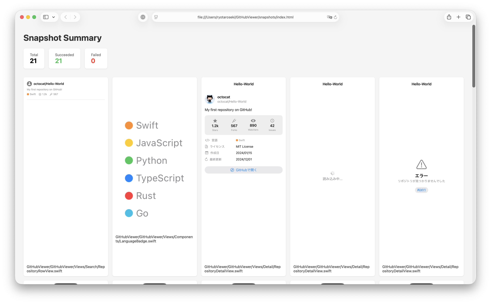
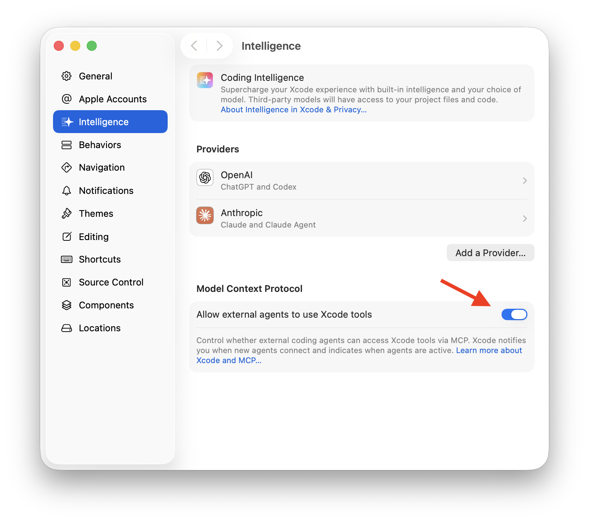
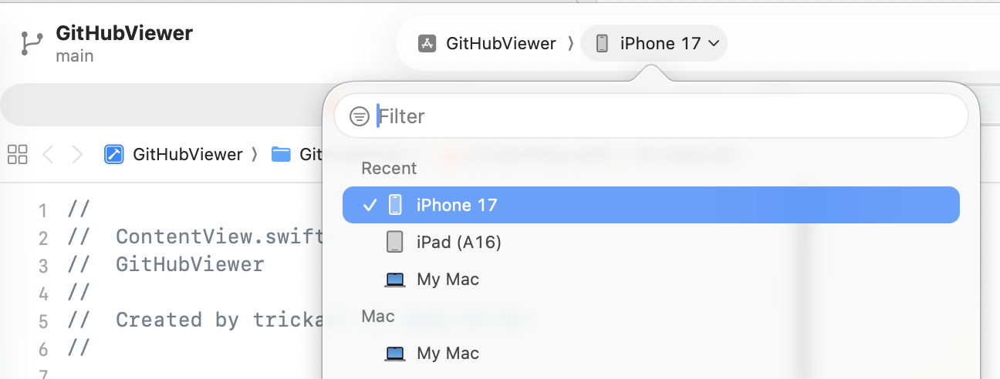
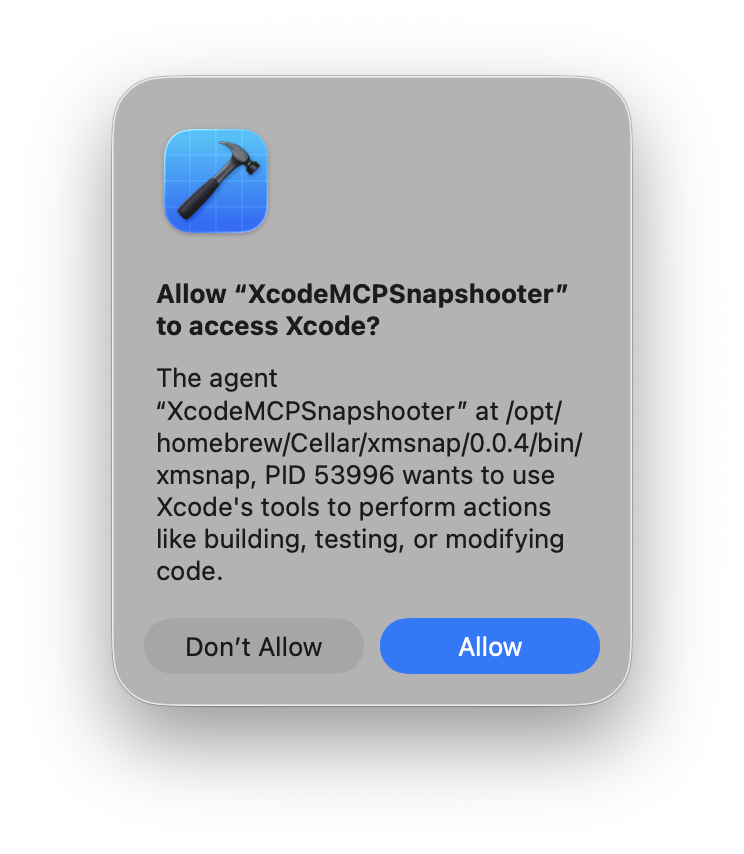
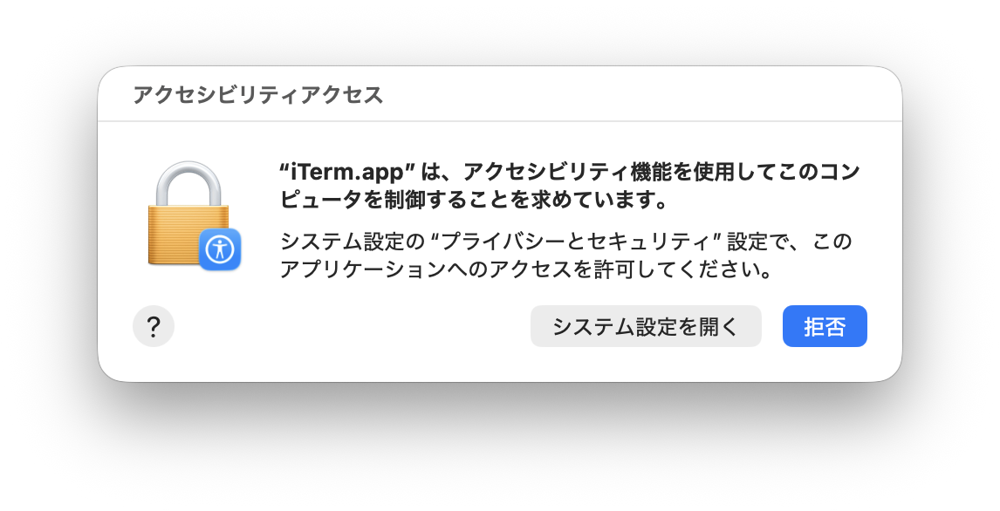

<!-- _class: title -->

# Xcode MCPで<br>スクリーンショット撮りを<br>90%自動化する

**xmsnap** — Xcode Preview自動キャプチャCLI

trickart

---

# 自己紹介

<!-- ここに自己紹介を記載 -->

- 名前：trickart
- 仕事：POSレジアプリ開発


---

# スクリーンショット撮影、ダルい…

- App Store用に全画面キャプチャ
- 社内ドキュメント用にも必要
- デバイス違い、ダークモード対応も…

---

# 既存の解決策とその限界

## XCUITest + fastlane snapshot
- セットアップが重い
- テストコードのメンテナンスコストが高い

## Xcode Previewを手動キャプチャ
- 1枚ずつ手作業 → 画面数が多いと非現実的

もっと **手軽に** スクショを自動化したい

---

# Xcode MCPとは？

Xcode 26で導入されたMCPサーバー

- MCP（Model Context Protocol）: AIツールとの標準通信プロトコル
- JSON-RPC 2.0で外部ツールからXcodeを操作可能
- `xcrun mcpbridge` 経由でstdio通信

```
┌──────────┐    JSON-RPC    ┌──────────┐          ┌───────┐
│  Client  │ ◄────────────► │   MCP    │ ◄──────► │ Xcode │
│          │    (stdio)     │  Bridge  │          │       │
└──────────┘                └──────────┘          └───────┘
```

---

# Xcode MCPでできること

MCPサーバーが提供するツール：

- **ビルド・実行**: プロジェクトのビルド、テスト実行
- **ソースコード操作**: ファイルの読み書き、検索
- **プレビュー**: Xcode Previewのレンダリング
- **ログ取得**: ビルドログ出力

> 今回は **プレビューのレンダリング** 機能を活用

---

# MCPのクライアントはAIだけじゃない

通常のMCPの使い方：

```
AI（Claude, Codex...） → MCP Server → ツール
```

今回のアプローチ：

```
普通のCLIツール → MCP Server → Xcode
```

- MCPは **JSON-RPCベースの汎用プロトコル** → AIでなくても使える
- つまりMCPはJSON-RPCでやり取りできれば**何でもつながる！**

---

# xmsnap

## Xcode Previewのスクショを自動で全部撮るCLIツール

```bash
# インストール
brew install trickart/tap/xmsnap

# 実行（これだけ！）
cd path/to/project
xed .
xmsnap
```

- プロジェクト内の `#Preview` / `PreviewProvider` を自動検出
- Xcode MCPでレンダリング → スクリーンショット保存

---

# 出力とオプション

```bash
# プレビュー一覧を確認
xmsnap --list

# 特定ファイルだけ指定
xmsnap ContentView.swift

# テスト・生成ファイルを除外
xmsnap --exclude Tests/

# 出力先指定
xmsnap -o ./screenshots

# HTMLギャラリーとして出力
xmsnap --format html
```

出力形式: `default` / `json` / `markdown` / `html`

---

# デモ：HTMLギャラリー出力

`xmsnap --format html` で生成されるギャラリー

- 全スクリーンショットを一覧で確認可能
- 静的ホスティングすればXcodeを触らないメンバーへの共有にも便利



___

<center>
<video src="xmsnap.mp4" controls height="650"></video>
</center>

---

# 仕組み

1. **MCP接続** — `xcrun mcpbridge` を起動、stdioで接続確立
2. **プレビュー検出** — `#Preview` / `PreviewProvider` を `XcodeGrep`
3. **レンダリング** — 1つずつ順番に `RenderPreview` でレンダリング
4. **キャプチャ・保存** — レンダリング結果をディレクトリにコピー

---

# そういえば残り10%って？

## 初回にXcodeの設定で `mcpbridge` の使用を<br>許可する必要がある(1/4)

- `Settings > Intelligence > Model Context Protocol > Allow external agents to use Xcode tools` をONに



---

## プロジェクトをXcodeで開いておく必要あり(2/4)

- `RenderPreview` は目的のプロジェクトを開いていないと出来ない
- xmsnapで `xed` を叩くようにするか迷ったがプロジェクトを開く時間は<br>マシンやプロジェクト規模によりwait時間が読めないので諦めた

---

## デバイス選択(3/4)

- 選択したデバイスでレンダリングされる
  - iPhone 17ならDynamic Island、iPhone 16eなら真四角
- `PreviewProvider` なら `.previewDevice(:)` で設定できるが<br> `#Preview` だと設定できず



---

## Xcodeの許可ダイアログ(4/4)

   - 接続時にXcodeが表示するダイアログ
   - **Allow**をクリックしなければならない
   - →対策あり！



---

## アクセシビリティ権限の許可(4/4)
   - アクセシビリティ機能を使って自動クリック機能を入れている
   - システム設定 > プライバシーとセキュリティ > アクセシビリティ
   - 使っているターミナルアプリ(xmsnapではない)にチェックを入れる
   - →結局一回は手動で行う必要あり…



---

# まとめ

## スクショ撮影の90%は自動化できる時代

- **Xcode MCP** でXcodeをプログラマブルに操作
- xmsnapはコマンド(と事前設定)でXcode Previewをキャプチャ

## 逆に完全には自動化出来ず…

- CIで使えたらもっと用途が広がるのに…
  - 社内ドキュメント自動更新とかVRTとか
- GUI操作をバイパスする方法があったらぜひ教えて下さい！！

---

<!-- _class: end -->

# Thank you!


GitHub: [trickart/XcodeMCPSnapshooter](https://github.com/trickart/XcodeMCPSnapshooter)

`brew install trickart/tap/xmsnap`

ref: [Giving external agentic coding tools access to Xcode | Apple Developer Documentation ](https://developer.apple.com/documentation/xcode/giving-agentic-coding-tools-access-to-xcode)
